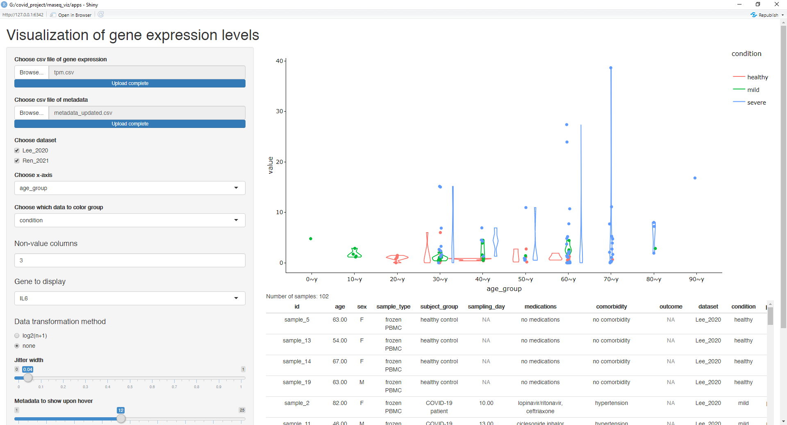

# rnaseq_viz

Visualization of normalized RNA-seq data using R Shiny app

## Description

This Shiny app was developed to aid in visualization of individual genes in different samples

This app takes both csv file of gene expression (preferrably normalized) and csv file of sample metadata and plots a violin + scatter plot. This app also shows the metadata of each sample upon hover on the individual point on the plot.

## Usage

### Setup

1. Open covid_shiny.Rproj file on RStudio
2. Open `apps/server.R` or `apps/ui.R`
3. Click on Run App button

### Menu prompts

1. Choose csv file of gene expression prompt
   - Upload csv file of normalized gene expression (TPM/other normalized counts)
   - This file should contain gene expression to be plotted, column names of sample names, and first few rows of gene symbol/name
   - Column name of gene identifier should be renamed to `external_gene_name`

2. Choose csv file of metadata
   - Upload csv file of file metadata containing sample description, etc
   - Csv file of metadata should contain column named `id` for sample identification
   - Csv file should also contain column named `dataset` for dataset identification
   - Column names of metadata should not contain white spaces
   - Columns will be used for X-axis and color groupings

### After uploading data

3. Choose dataset
   - Users can choose multiple datasets to plot

4. Choose x-axis
   - Users can choose which metadata column to use for x-axis plotting

5. Choose which data to color group
   - Users can choose which metadata column to use for grouping samples
 
6. Non-value columns
   - Users can choose the number of non-value columns from the gene expression csv file, in the example, 3 columns were designated for gene name, gene id and description and thus 3 were selected for omission

7. Gene to display
   - Users can choose which gene for the expression level to be displayed

8. Data transformation methods
   - Users can choose to perform log transformation or no transformation on data

9. Jitter width
   - Users can control the width of dotplot jitter width

10. Metadata to show upon hover
   - Users can choose the number of total metadata to show upon hover (currently selection is only by the order of column position)

11. Text size
   - Users can choose the overall text size, when there are more categories, text might overlap with each other and thus smaller text size can be preferable

### Miscellaneous

- Users can manipulate graph using plotly GUI (zooming in, etc)
- Users can hover on the data points to check metadata each point is associated with

